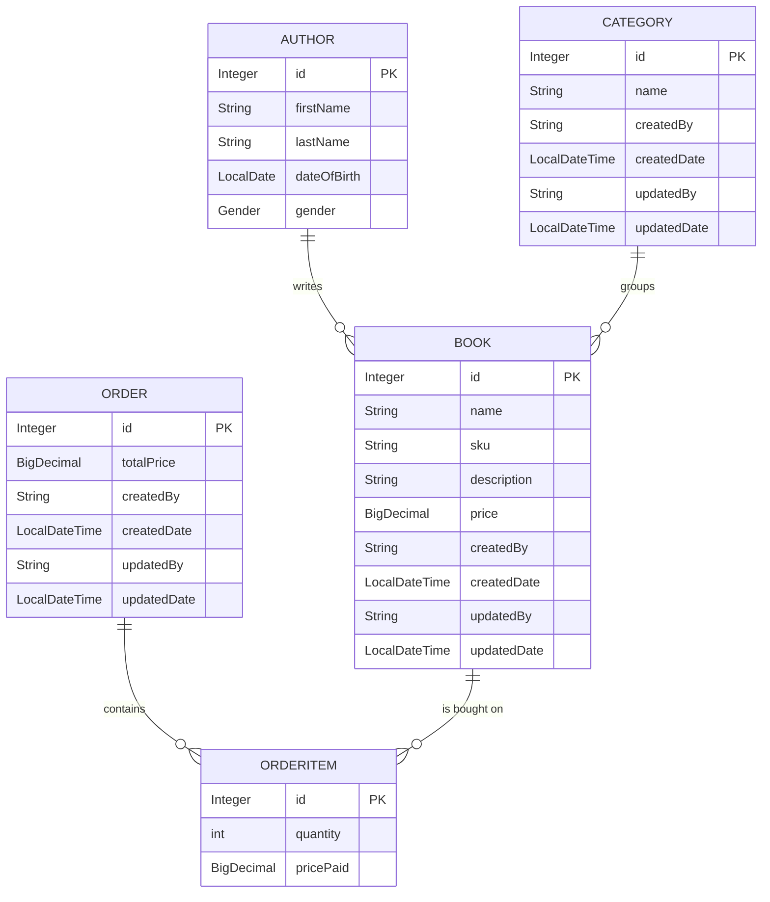

# Domain & Business Capabilities

> Slice 0 of the Bookstore documentation set. This guide describes **what the
> system is for** and **how its data is shaped** — the domain vocabulary the
> later slices (architecture, database, API) build on. It deliberately contains
> no HTTP/endpoint detail and no controller/service/repository internals.
>
> Facts here are pinned to the model classes under
> `src/main/java/practise/models/**` at commit `cf70c14`.

## Overview

The Bookstore is a **server-side Spring Boot backend** (Spring Boot 3.1.0,
Java 17, Maven, PostgreSQL) for running a small online book business. It owns
the catalogue of books, the people who write them, the categories that group
them, the customer orders placed against them, and a sales report derived from
those orders. There is no user interface in this repository — the system
exposes its capabilities as a backend service for other clients to consume.

In business terms, the system answers four questions and produces one summary:
*what books do we sell, who wrote them, how are they grouped, what has been
ordered* — and, on demand, *how much money came in per day over a period*.

## Business capabilities

The backend offers five capabilities. The first four manage long-lived data;
the fifth is a read-only query over what the others have recorded.

### 1. Books

Manages the **catalogue** — the products the store sells. Each book has a name,
an SKU, a description and a price, and is linked to the **author** who wrote it
and the **category** it belongs to. This is the central entity of the domain:
authors, categories and orders all exist to describe or transact against books.

### 2. Authors

Manages the **people who write the books**. An author has a name, a date of
birth and a gender, and owns the set of books attributed to them. Authors are
reference data for the catalogue — a book points at exactly one author, and an
author can have many books.

### 3. Categories

Manages the **groupings used to organise the catalogue** (for example a genre
or subject). A category has a name and owns the set of books filed under it. As
with authors, a book belongs to one category and a category holds many books.

### 4. Orders

Records a **customer purchase**. An order is a collection of **line items**,
where each line item names a book, the quantity bought and the price paid for
it at the time of the order. The order's total price is the sum of its line
items' subtotals (see [Derived values](#derived-and-computed-values)). An order
never references books directly — it always goes through its line items.

> Orders can also be looked up by a fragment of the book author's name. That is
> a query feature; its request/response shape is documented by the API slice
> (**EXP-5**), not here.

### 5. Reports (sales report)

Produces a **read-only sales summary**: for a requested date range, the total
paid amount **per day**. It is a query over existing orders — orders are grouped
by their creation date and each day's order totals are summed — and returns a
map of *date → paid amount*. 

There is **no `Report` entity** and nothing is stored: the report is computed on
each request from the orders already on record. (Its exact numeric type and the
date-boundary semantics are behavioural quirks documented under Known
limitations, **EXP-8**, and the API contract, **EXP-5**.)

## Domain model

Every persistent entity lives under `src/main/java/practise/models/**`. Two
shared base classes supply common fields, and one enum supplies a fixed value
set. Field types below are exactly as declared in the Java model classes.

### Shared bases

#### `BaseEntity` (`models/BaseEntity.java`)

The root of every entity — provides only the primary key.

| Field | Type | Notes |
| --- | --- | --- |
| `id` | `Integer` | Primary key, database-generated identity |

#### `AuditModel` (`models/AuditModel.java`) — extends `BaseEntity`

Adds creation/update audit metadata. Entities that extend `AuditModel` inherit
the `id` **plus** the four audit fields below; entities that extend
`BaseEntity` directly get the `id` only.

| Field | Type | Notes |
| --- | --- | --- |
| `createdBy` | `String` | Stamped on insert; not updatable |
| `createdDate` | `LocalDateTime` | Stamped on insert; not updatable |
| `updatedBy` | `String` | Stamped on insert and on every update |
| `updatedDate` | `LocalDateTime` | Stamped on insert and on every update |

> **Audit user is a constant.** On persist/update the audit fields are stamped
> with a hardcoded system user (`"Arthur"`) rather than the acting user. This is
> noted here as domain behaviour; the deeper "is this correct?" framing belongs
> to Known limitations (**EXP-8**).

#### `Gender` (`models/author/Gender.java`)

A fixed enum used by `Author`. Three values: **`Male`**, **`Female`**,
**`Else`**. (`Else` is a real value — it is part of the domain, not a
placeholder.)

### Entities

#### `Book` (`models/Book.java`) — extends `AuditModel` *(audited)*

| Field | Type | Notes |
| --- | --- | --- |
| `name` | `String` | |
| `sku` | `String` | Stock-keeping unit |
| `description` | `String` | |
| `price` | `BigDecimal` | The book's current catalogue price |
| `author` | `Author` | The author who wrote the book (many books → one author) |
| `category` | `Category` | The category the book is filed under (many books → one category) |
| *inherited* | | `id` + the four audit fields from `AuditModel` |

#### `Author` (`models/author/Author.java`) — extends `BaseEntity` *(not audited)*

| Field | Type | Notes |
| --- | --- | --- |
| `firstName` | `String` | |
| `lastName` | `String` | |
| `dateOfBirth` | `LocalDate` | |
| `gender` | `Gender` | One of `Male` / `Female` / `Else` |
| `books` | `List<Book>` | The books written by this author (one author → many books) |
| *inherited* | | `id` only — **no audit fields** |

#### `Category` (`models/Category.java`) — extends `AuditModel` *(audited)*

| Field | Type | Notes |
| --- | --- | --- |
| `name` | `String` | |
| `books` | `List<Book>` | The books in this category (one category → many books) |
| *inherited* | | `id` + the four audit fields from `AuditModel` |

#### `Order` (`models/order/Order.java`) — extends `AuditModel` *(audited)*

| Field | Type | Notes |
| --- | --- | --- |
| `totalPrice` | `BigDecimal` | Sum of its line items' subtotals (see below) |
| `orderItems` | `List<OrderItem>` | The line items that make up the order (one order → many line items) |
| *inherited* | | `id` + the four audit fields from `AuditModel` |

#### `OrderItem` (`models/order/OrderItem.java`) — extends `BaseEntity` *(not audited)*

A single line of an order — one book, in some quantity, at a captured price.

| Field | Type | Notes |
| --- | --- | --- |
| `book` | `Book` | The book bought on this line (required; many line items → one book) |
| `quantity` | `int` | How many copies were bought |
| `pricePaid` | `BigDecimal` | The price **paid at order time** — a snapshot, distinct from `Book.price` |
| `order` | `Order` | The order this line belongs to (many line items → one order) |
| *inherited* | | `id` only — **no audit fields** |

> **`pricePaid` vs `Book.price`.** A line item records `pricePaid` when the order
> is placed. `Book.price` is the book's *current* catalogue price and can change
> later. Orders are therefore price-snapshots: re-pricing a book does not rewrite
> past orders.

### Audit asymmetry (read this)

Auditing is **not** uniform across the model:

| Entity | Base class | Audited? |
| --- | --- | --- |
| `Book` | `AuditModel` | ✅ yes |
| `Category` | `AuditModel` | ✅ yes |
| `Order` | `AuditModel` | ✅ yes |
| `Author` | `BaseEntity` | ❌ no |
| `OrderItem` | `BaseEntity` | ❌ no |

`Author` and `OrderItem` carry an `id` and nothing else from the bases — they
have **no** `createdBy/createdDate/updatedBy/updatedDate`. Do not assume every
entity records who created or changed it.

### Derived and computed values

Two values are computed rather than entered directly:

- **`OrderItem` subtotal** = `pricePaid × quantity`. It is calculated from the
  line item's own fields and is not a stored column you set.
- **`Order.totalPrice`** = the sum of all its order items' subtotals. It is
  (re)computed from the line items, so an order's total always reflects its
  current set of lines.

## Relationships and cardinalities

| Relationship | Cardinality | Owning side |
| --- | --- | --- |
| Author → Book | 1 → * (one author has many books) | `Book.author` |
| Category → Book | 1 → * (one category has many books) | `Book.category` |
| Order → OrderItem | 1 → * (one order has many line items) | `OrderItem.order` |
| OrderItem → Book | * → 1 (many line items reference one book) | `OrderItem.book` |

Notable consequences:

- A **book** sits at the centre: it has exactly one author and one category, and
  it can appear on many order lines across many orders.
- An **order** reaches books **only through its order items** — there is no
  direct Order→Book link.

## Entity-relationship diagram

*Reports does not appear in the diagram — it is a query over `ORDER`, not an
entity.*

## Related documentation

This guide owns the domain vocabulary only. Other concerns are documented by
sibling slices:

- **Architecture & code structure** (layering, generic CRUD, packages) — EXP-3.
- **Database, PostgreSQL & Liquibase** (schema, migrations, bootstrap) — EXP-4.
- **REST API & Swagger reference** (endpoints, verbs, response envelope, the
  orders author-keyword search, the reports date-range query) — EXP-5.
- **Known limitations & inconsistencies** (hardcoded audit user, report numeric
  precision and date-boundary semantics) — EXP-8.
